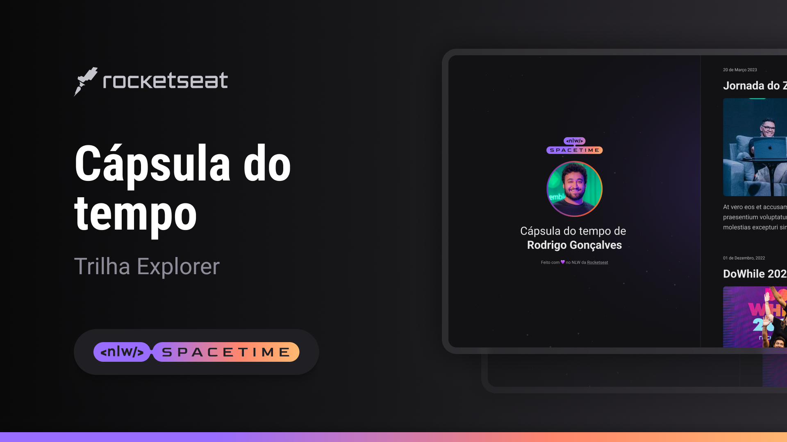

## Projeto 🖥️
Esse é um projeto Web Reponsivo de uma cápsula do tempo para exibir memórias.

## Tecnologias 🚀
Esse projeto foi desenvolvido durante o NLW da Rocketseat utilizando as seguintes tecnologias:

- HTML
- CSS
- Git e Github

## Layout 🏷️
Você pode visualizar o layout deste projeto através [deste link](https://www.figma.com/file/F2Cy5zZCgcW0jLDtoq0HGp/C%C3%A1psula-do-tempo-%E2%80%A2-Trilha-Explorer-(Community)?type=design&node-id=306%3A84&t=xNLQK6jiC61OuKfP-1).
É necessário ter uma conta no [Figma](https://www.figma.com)

